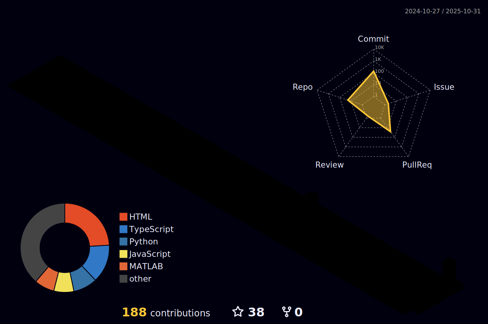

  
# Hi, I am Rishabh

**Tech Explorer | ML/DL Enthusiast | DSA Solver | OpenCV**

Second-year Mathematics & Computer Science undergrad at DTU, New Delhi
I love tinkering with machine learning algorithms, building deep learning models, and solving complex real-world problems using OpenCV and data structures.
You'll find me building neural networks, debugging vision pipelines, or optimizing code for that last millisecond.
Here to push the boundaries of AI, compete in hackathons, and contribute to open-source one commit at a time!

 

  

## About Me

<table>
<tr>
<td width="50%">

- Passionate developer with a love for building innovative solutions and exploring cutting-edge technologies
  
- Diving deep into the world of **Artificial Intelligence** and **Deep Learning**, constantly experimenting with neural networks and computational models

- Avid problem solver who enjoys tackling complex algorithmic challenges and optimizing code performance

- Lifelong learner who thrives on staying updated with emerging tech trends and pushing the boundaries of what's possible
</td>
<td width="50%">

</td>
</tr>
</table>

## Tech Stack & Skills

**Languages:**

**ML / DL:**

**Tools:**

## Stats & Achievements

  
  

## Activity & Contributions

  

## Connect

  
  
  

